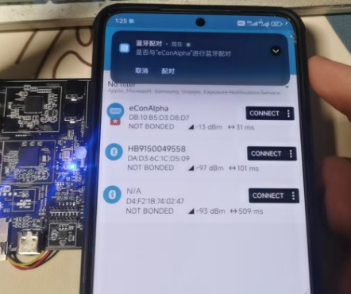
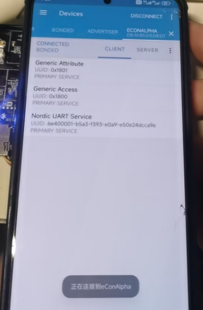
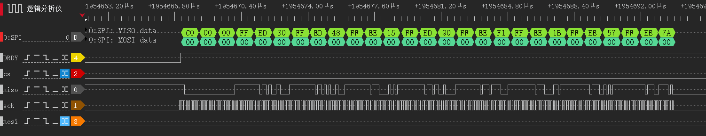
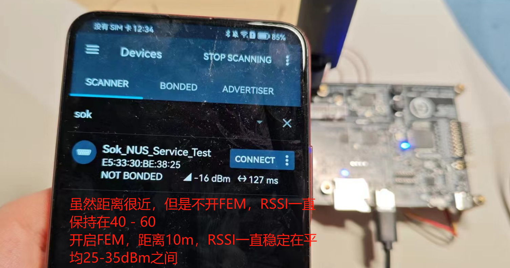
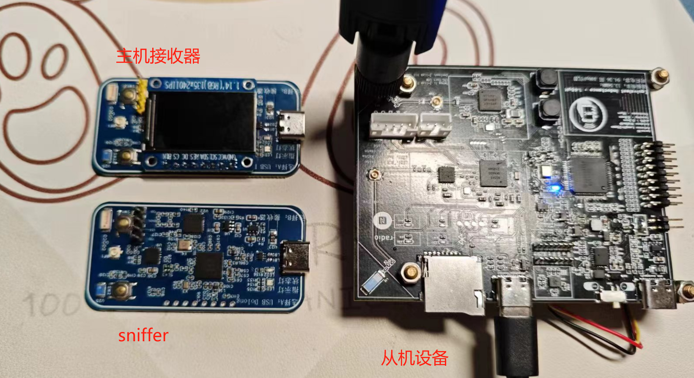

# nRF5340_Softdevice_note_Sosssk
Record my verification code in Bilibili column tutorial<br>
## update 2024-05-19
新增NFC 00B带外配对功能<br>
工程新增文件
- [x] src-> nfct_oob.c
- [x] src-> nfct_oob.h

prj.conf新增内容<br>
* 1 POLL:用于TNEP事件轮询
* 2 SMP：带外配对开启SMP安全协议
* 3 NFC：相关（NDEF, TNEP, T4T, NDEF_LE_OOB, NDEF_TEXT等等）
  
nfct_oob程序思路
> /***********pair key perpare板块************/<br>
> 在main中读取到本地地址，传递给临时密钥TK，初始化&pair_signal轮询事件，事件里面准备好<br>
> 就填充密钥，同时赋值给&oob_local<br>
>  /***********sercurity conn模块************/<br>
> 定义好安全配对中---身份验证回调事件和认证成功配对信息回调事件的初始化赋值（函数）
>  /***********tnep tag oob模块************/<br>
> 定义好tnep切换服务事件结构体，必须填充‘收到连接请求回调事件’<br>
> tnep初始化中通过nfc_tnep_initial_msg_encode初始化message编码为tnep<br>
> 本代码中除了添加tnep的连接切换服务，同时添加了一个带有text的record的message<br>
> 最后程序初始化各个模块<br>

具体SMP连接知识，参考文档和nordic B站视频，以及nordic开发者学院BLE第5课程

注意点
* 1 ：读取本机ADD需要在网络核读取，所以开一些hci的头文件。（nRF53双核）
* 2 ：蓝牙连接上以后就不需要poll和paring_key_process等操作


## update 2024-05-04
新增传感器读取功能，同时添加NUS服务数据交换功能<br>
工程新增文件
- [x] src-> ads1299.c
- [x] src-> ads1299.h

新增功能逻辑如下
* 1：开启1299传感器功能
* 2：开启gpiote功能，在1299外部引脚(DRDY)上升沿发送旗标，然后在send_data_thread_id线程里面通过spi读取1299数据，随后压入队列
* 3：循环检测队列是否为空，不为空从队列里面取出数据，通过NUS RX特征发送出去
* 4：NUS TX特征添加获取命令交互，收到字符串'T' 开始采集数据， 收到字符串'R'停止采集数据

注意要点
* notice 1：不能在外部引脚中断读取数据，不然spi会报timeout err，猜测gpiote中断优先级5，系统内有thread优先级高于此，所以这是一个大坑，之前在中断读数据一直是错误的。
* notice 2：1299硬件上如果只有1片，不使用菊花链，START引脚可以拉高。不用拉低，在程序内在使用start命令

实际测试功能
> 堆栈压入压出逻辑功能正确<br>
> 数据读取功能正常<br>
> spi时许正确，请参考下图<br>


逻辑分析仪测试图
采集1299 8个通道数据，1个通道3bytes，第一个bytes是STAT_LOFF，有兴趣自己阅读1299手册有说明。所以一包采集共计4*8+3 = 27bytes


后续内容：在NUS部分在做一个OOB的NFC配对，BLE部分完结，更新Blibli内容，方便自己那天用到类似项目直接copy。在完后学习开发板的nRF7002和nRF5340的ESB，做实际产品可能通道更高吞吐量无线协议


## update 2024-04-29
更新FEM功能<br>
添加方式比较简单<br>
在child_image添加网络和的conf和overlay<br>
> *使用FEM需要用到nordic的MPSL库，配置Kconfig设置如下<br>

hci_ipc.conf添加内容有
```C+
CONFIG_MPSL=y
CONFIG_MPSL_FEM=y
CONFIG_MPSL_FEM_SIMPLE_GPIO=y
CONFIG_BT_CTLR_TX_PWR_ANTENNA=14
```
> *同时网络核的设备树里添加FEM引脚地址节点定义

hci_ipc.ocerlay添加内容有
```C
/ {
    nrf_radio_fem: name_of_fem_node {
       compatible  = "nordic,nrf21540-fem";
       tx-en-gpios = <&gpio0 30 GPIO_ACTIVE_HIGH>;
       rx-en-gpios = <&gpio0 31 GPIO_ACTIVE_HIGH>;
       pdn-gpios   = <&gpio1 10 GPIO_ACTIVE_HIGH>;
 };
};
```
> *注意点：在nRF5340里面，如果需要网络核配置引脚，需要应用核先释放引脚，所以应用核也需要配置overlay

应用核的overlay添加配置如下，用于释放引脚到网络核
```C
&gpio_fwd{
    /delete-node/ uart;
    nrf21540-gpio-if{
        gpios = <&gpio0 30 0>,
        <&gpio0 31 0>,
        <&gpio1 10 0>,
        <&gpio1 11 0>;
    };
};
```
新增内容2：K_timer定时器的回调函数里面添加判断，蓝牙连接上以后常亮指示灯，蓝牙断开后闪烁指示灯。

 *编写总结：* 实际测试添加FEM前，手机读取RSSI = -80dBm，添加FEM后读取RSSI = -25dBm
 
[]


## update 2024-04-24
更新NUS分支，同时master变基分支（用于copy修改后续内容）<br>
> 新增核心功能<br>

1 . USB CDC中断新增双缓冲<br>
```C
uint8_t rx_buffer[2][DATA_SIZE_MAX];
uint8_t *next_buf = rx_buffer[1];
注意回调事件UART_RX_BUF_REQUEST里面切换缓冲区
```
2 . 新增定时K_timer<br>
  暂时的功能只有闪烁BLE指示灯，后续在做更改

3 . 新增队列device_message_queue，以及缓冲逻辑<br>
  * 新增和老版nRF52一样，新建一个内存池my_data_array[5000]
  * 自定义buffer_t结构体，结构体元素1.数据头指针  2.数据长度
  * 通过kernel自带的队列，USB接收到数据复制到内存池，将指针和长度存入结构体压入队列
  * 然后在从队列取出信息，通过NUS_Send，串口服务的Tx特征发送给手机（服务端）

后续在优化内容<br>
1：添加FEM工作<br>
2：添加传感器，数据也是存入内存池，做缓冲操作发送给主机<br>


## update 2024-04-21
更新master分支，内容NUS透传服务部分<br>
1. 工程文件夹新增《child_image》:用于修改子image的config文件
2. 新增overlay文件，添加USB CDC需要的设备节点
3. main.c文件添加函数可以动态修改连接参数le_params<br>
4. 新增USB_CDC_ACM功能，用于NUS服务的串口外设，添加async_adapter.c增加异步功能

增加串口透传服务思路（在原有LBS服务上修改步骤）
* 1：conf中添加CONFUG_BT_NUS = y，系统会调用nus.c / nus.h文件
* 2：添加nus的服务与初始化
* 3：USB_CDC的config注意连锁使能,初始化去掉串口流等待
<br>====================进度=======================<br>
已经可以实现NUS基本功能，尚未添加数据收发逻辑。历程中用的UART0，这里换成USB。新增child_image文件夹，用于设置hci_ipc网络核的config


## update 2024-04-18
新增分支LBS<br>
主要：学习到lesson4的内容，LBS点灯/按键服务知识<br>
> 工程新增文件<br>
- [x] src-> my_lbs.c
- [x] src-> my_lbs.h
    #### 1. main.新建内容<br>
    * 新增连接参数修改（PHY、MTU、连接间隔）
    * 更新发生才连接回调事件内on_connected（），在BT回调事件里面添加更新成功打印log的功能函数
    * notice ： prj要定义FPU和更新连接参数的配置
    * mian.c中新建一个线程（send_data_thread_id），用来定时模拟传感器发送数据
    #### 2. lbs.c 内容<br>
    * 参考DevAcademy教程，添加按键点灯服务
    * 服务下新增特征
      * 1 点灯特征 属性：write
      * 2 按键特征 属性：indicate & read 
      * 3 传感器特征 属性：notify(可选择使能描述符)


##  update 2024-04-14
记录基于BLE协议栈的调试代码（peripheral-uart）<br>
笔记思路
1. 广播（响应，广播参数更新）
2. 链接（CLE, DLE, PHY, 连接参数更新）
3. 数据透传（重发，缓存）


## **Create the first repository** 
专栏前8节内容有关nRF5340外设知识，比较简单<br>
> * 1 - nRF5340硬件学习的资料汇总
> * 2 - 设备树初步学习汇总
> * 3 - NCS组成架构
> * 4 - 在VScode中打印程序调试log
> * 5 - 串口外设
> * 6 - IIC外设
> * 7 - SPI + USB ACM CDC外设
> * 8 - NFCT外设
---
> 文档内容可以参考blibli专栏介绍<br>
[本人专栏链接](https://member.bilibili.com/platform/upload-manager/opus) 
---
### 文件夹目录内容说明<br>
| 文件夹名称                                        | 内容     
| -------                                          | :--------:  
| src                                              | 主代码
| .gitgnore                                        | git上传去掉build部分，用户子自己添加SDK编译会生成  
| CMakeLists                                       | 编译项   
| prj.conf                                         | Kconfig配置文件   
| EDA_data                                         | 嘉立创的原理图
| picture                                          | 需要展示的测试图片
| nrf5340dk_nrf5340_cpuapp.overlay                 | 修改自定义设备树
| child_image                                      | 子image的conf修改文件

[]
